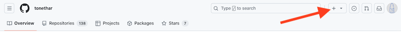
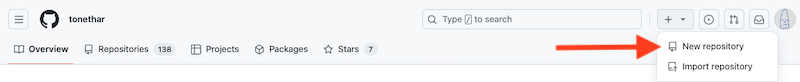
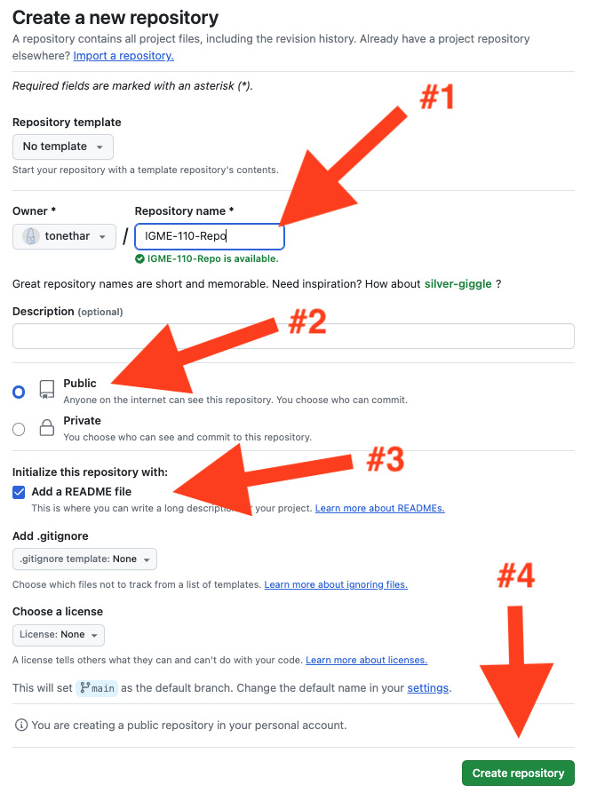
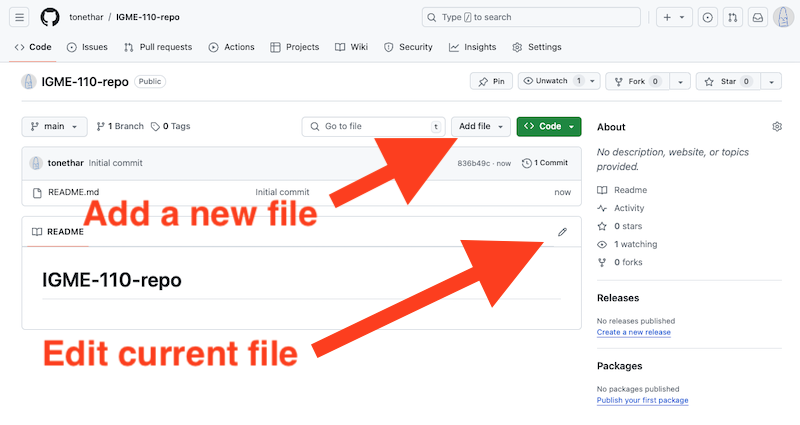

# Github Intro & Make a "Listicle"!

## Part A - Setup your GitHub Account

1. Please set up your GitHub account (you may already have one, or you might have already set it up for a GCCIS programming class).
You will need to give GitHub your school email address at some point. 
Tip: You will likely have this account for a long time, so choosing a SFW ("Safe for Work") user name is advisable.

2. Apply for the student developer pack (this will give you FREE private repos).

3). Here's the link for signing up: https://github.com/education

---

## Part B - Create a GitHub Repository (aka "repo")

### 1 - 

---

### 2 - 

---

### 3 - 

---

### 4 - 

---

## Part C - Create a Listicle!

- Here are some examples:
  - https://github.com/public-api-lists/public-api-lists
  - https://github.com/leereilly/games

